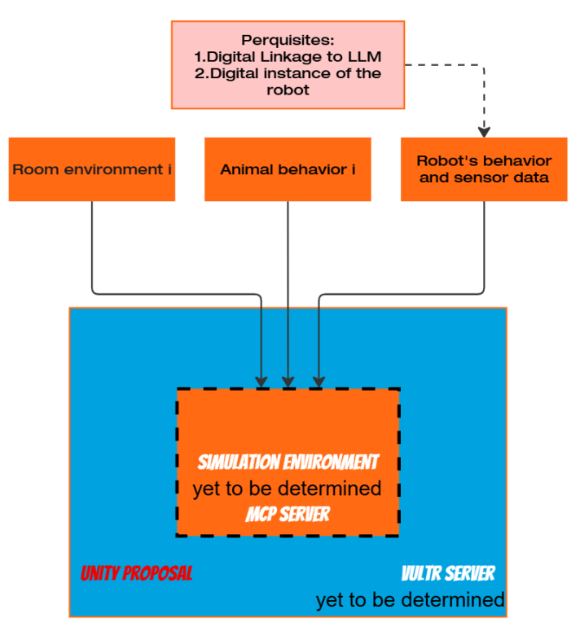

# PetGuard 🐾🤖  
**Turn any desk/toy robot into a proactive, non-invasive pet assistant.**

PetGuard is a software-based service that enables consumer robots (e.g., Vector or similar desktop robots) to actively engage in a pet’s daily life—supporting wellbeing, preventing mishaps, and providing owners with actionable insights—without being destructive or intrusive.

Link to LLM Processing Repository: https://github.com/Jaswir/Pet-Guards/tree/Kai-branch

---

## Why PetGuard?

Pets (especially cats) can develop new habits or stress responses that go unnoticed until something breaks—literally (plants, dishes, furniture) or medically (changes in activity, appetite, sleeping patterns).

PetGuard is designed to help in three key ways:

### 1) Prevent trouble before it happens  
When your cat is about to do something risky or destructive (e.g., eating plants, jumping into restricted zones, knocking items), the robot can **intervene proactively** using gentle, non-invasive actions:
- distraction (movement, sound, positioning)
- redirection (guiding attention elsewhere)
- “soft boundaries” (presence and behavioral nudges)

### 2) Observe behavior & flag changes  
PetGuard can record behavioral patterns over time and detect meaningful changes such as:
- reduced movement/activity
- unusual pacing or repetitive behavior
- altered play frequency
- changes in routine or interaction preference

When something deviates from the cat’s baseline, PetGuard can recommend follow-up actions (including “consider a vet visit”).

### 3) Enrich daily life through play & companionship  
Even when nothing “bad” is happening, PetGuard can act as a playful companion:
- toy-like behaviors (ball imitation, chase prompts)
- curiosity interactions (following, turning, peeking)
- friendly presence routines

---

## Project Status

This repository currently focuses on:
- a **Unity simulation environment** to test scenarios,
- a **robot decision loop** supported by a server bridge,
- initial rule/scenario-based cat behavior,
- and a future roadmap toward probabilistic modeling + LLM fine-tuning.

---

## High-Level Architecture (Plain Language)

We use **Unity** to simulate a shared world containing three main entities:

1. **Room environment** (layout, objects, hazards, “cat trouble spots”)  
2. **Animal** (the cat: movement + scenario-driven behavior)  
3. **Robot** (Vector’s digital instance: sensors + actions)

A **Vultr server** acts as the communication bridge between:
- the robot side (sensor signals / state),
- and an LLM (e.g., Gemini) used for higher-level reasoning and decision support.

> In other words: Unity produces world-state, the robot produces sensor-style signals, a server forwards structured info to an LLM, and the LLM (plus logic) suggests what the robot should do next.

---

## Architecture Diagram

